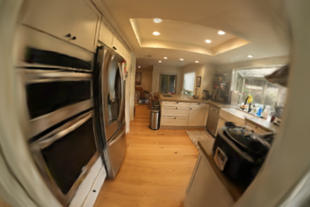
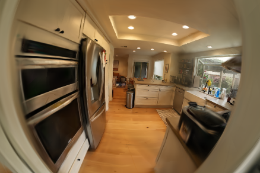

# Ray tracing 3D Gaussians

This repository contains my Master’s thesis work on **ray tracing–based rendering of 3D Gaussians**, with a focus on re-examining the assumptions behind recent Gaussian splatting and ray tracing methods, and designing a custom ray tracing based pipeline. 

## Contents

- **Differentiable ray tracer for 3D Gaussians**
  - Custom OptiX-based ray tracing pipeline
  - End-to-end differentiable rendering and learning setup
  - Achieves slightly improved results compared to [3DGRUT](https://github.com/nv-tlabs/3dgrut)

- **Wide-angle / distorted camera support**
  - Patch for [FisheyeGS](https://github.com/zmliao/Fisheye-GS) in [here](https://github.com/matias-v441/gsrt/tree/devel/nbs-3dgs-fs)
  - Patch for [NerfBaselines](https://github.com/nerfbaselines/nerfbaselines) (undistortion procedure)

The project is primarily intended as a **technical artifact** demonstrating algorithmic design, numerical considerations, and  trade-offs, rather than a polished end-user library.

## Status

This repository reflects the state of the thesis implementation.
Some components are still being cleaned up and documented, but the code is released to make the core ideas and design decisions inspectable.

## Installation 
The project relies on NVIDIA OptiX and CUDA for performance-critical ray tracing:

- CUDA 11.8
- OptiX 8

See the setup script and CMake configuration for details.

## Renders (splats vs rays)

